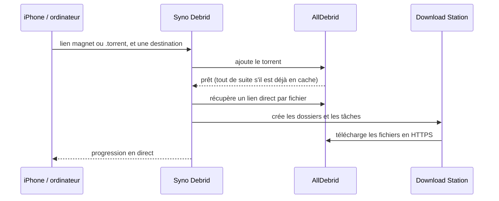

<p align="center">
  
</p>

<h1 align="center">Syno Debrid</h1>

<p align="center"><a href="README.md">English</a> · <b>Français</b></p>

<p align="center">
  Téléchargez vos torrents sur votre Synology via AllDebrid.<br>
  Ajoutez un lien magnet ou un fichier <code>.torrent</code>, choisissez un dossier, et
  <b>Download Station</b> s'occupe du reste.
</p>

<p align="center">
  
  
  
</p>
<p align="center">
  
</p>

<details>
<summary>Plus de captures</summary>

<p align="center">
  
  
  
</p>
<p align="center">
  
  
</p>

</details>

## Fonctionnalités

- **Pas de P2P sur votre NAS.** AllDebrid télécharge le torrent, puis votre NAS récupère les
  fichiers chez AllDebrid, en HTTPS.
- **Liens magnet et fichiers `.torrent`.** Collez un ou plusieurs liens magnet (ou de simples
  hash), ou ajoutez un fichier `.torrent` : par glisser-déposer sur ordinateur, depuis l'app
  Fichiers sur iPhone.
- **Directement dans le bon dossier.** Créez vos destinations (Films → `video/Films`, Séries →
  `video/Séries`…) en parcourant les dossiers du NAS, et créez-en de nouveaux au passage si
  besoin. Vous n'avez plus qu'à en choisir une à chaque ajout ; l'app retient votre dernier choix.
- **Bien rangé, comme avec un client BitTorrent.** Un torrent de plusieurs fichiers a son propre
  dossier, sous-dossiers compris.
- **Suivi en direct.** Suivez chaque téléchargement chez AllDebrid, puis dans Download Station,
  fichier par fichier. Relancez un téléchargement en échec, ou arrêtez-en un en cours.
- **Deux comptes bien séparés.** Vous vous connectez à l'app avec son propre mot de passe, ou sans
  mot de passe derrière un proxy qui gère la connexion (Authelia…). L'app, elle, crée les
  téléchargements avec le compte DSM de votre choix, idéalement un compte dédié, et s'y reconnecte
  toute seule : les téléchargements continuent sans vous.
- **Pensée pour l'iPhone.** Ajoutez-la à l'écran d'accueil. Elle suit le mode sombre et parle
  français et anglais.
- **Légère.** Une image Docker d'environ 60 Mo (amd64 et arm64), sans base de données.

## Comment ça marche



## Installation sur un Synology

Il vous faut DSM 7.2 ou plus récent, avec **Container Manager** et **Download Station** installés
depuis le Centre de paquets.

1. Dans **File Station**, créez un dossier `docker/syno-debrid`.
2. Dans **Container Manager**, allez dans **Projet → Créer** et remplissez :
   - Nom du projet : `syno-debrid`
   - Chemin : le dossier que vous venez de créer
   - Source : « Créer docker-compose.yml »

   Collez ensuite le contenu de [`docker-compose.yml`](docker-compose.yml).

3. Validez. Container Manager télécharge l'image et démarre le conteneur.
4. Ouvrez **`http://IP-DU-NAS:8080`** et créez votre compte.
5. L'écran d'accueil vous indique ce qu'il reste à configurer, le tout dans les **Réglages** (⚙︎) :
   - connecter Download Station avec l'adresse du NAS (`http://IP-DU-NAS:5000`) et un compte DSM ;
   - coller votre clé API AllDebrid ;
   - ajouter vos destinations.

La première personne qui ouvre l'app crée le compte : faites-le avant de rendre l'app accessible
depuis Internet.

`PUID` et `PGID` définissent à qui appartiennent les fichiers de `./data`. `1026:100` correspond
en général au premier utilisateur créé sur le NAS, dans le groupe `users` ; lancez `id` en SSH
pour vérifier. Vous n'utilisez pas Container Manager ? Un simple `docker compose up -d` suffit.

### Un compte DSM dédié (conseillé)

L'app n'a besoin que de Download Station et de vos dossiers de téléchargement. Lui donner son
propre compte limite ce qu'elle peut faire sur votre NAS :

1. Dans **Panneau de configuration** → **Utilisateur et groupe**, créez un utilisateur, par
   exemple `syno-debrid`, avec un mot de passe solide.
2. Donnez-lui la lecture/écriture sur vos dossiers de destination (`video`…), et aucun accès aux
   autres dossiers partagés.
3. Dans ses permissions d'applications, n'autorisez que **Download Station** et **File Station**.

Les fichiers téléchargés appartiennent alors à ce compte. L'accès à ces fichiers reste géré par
les droits de vos dossiers partagés.

## Mise à jour

Dans **Container Manager** :

1. Dans **Projet**, sélectionnez `syno-debrid`, puis **Action** → **Arrêter**, et **Action** →
   **Nettoyer**. Seul le conteneur est supprimé, pas vos données.
2. Dans **Image**, supprimez `ghcr.io/piitaya/syno-debrid`.
3. De retour dans **Projet**, sélectionnez `syno-debrid`, puis **Action** → **Construire**.
   Container Manager télécharge la dernière image et relance l'app.

Avec Docker Compose : `docker compose pull && docker compose up -d`.

### Sauvegarde

Tout ce que l'app conserve se trouve dans le dossier `data` du projet : votre compte, les
réglages, la clé API AllDebrid, les sessions et les téléchargements en cours, dans des fichiers
JSON lisibles uniquement par leur propriétaire. C'est ce dossier qu'il faut sauvegarder. Il
contient aussi le mot de passe DSM chiffré et sa clé (`secret.key`) : gardez votre sauvegarde
privée.

## Configuration

Votre compte, la connexion à Download Station, la clé API AllDebrid et les destinations se
configurent dans l'app. Le reste passe par des variables d'environnement :

| Variable           | Par défaut      | Rôle                                                                               |
| ------------------ | --------------- | ---------------------------------------------------------------------------------- |
| `PUID` / `PGID`    | `1000` / `1000` | Propriétaire des fichiers de `/data`.                                              |
| `PORT`             | `8080`          | Port sur lequel l'app écoute.                                                      |
| `TRUST_PROXY`      | `false`         | Fait confiance à `X-Forwarded-For`. À activer derrière un proxy inversé.           |
| `AUTH`             | `password`      | `none` désactive la connexion, quand un proxy inversé s'en charge (voir plus bas). |
| `SESSION_TTL_DAYS` | `30`            | Nombre de jours sans ouvrir l'app avant d'être déconnecté.                         |
| `LOG_LEVEL`        | `info`          | `debug`, `info`, `warn` ou `error`.                                                |

## Comptes et sécurité

- **Votre compte.** Vous le créez à la première ouverture de l'app, avec un mot de passe d'au
  moins 8 caractères. Le changer dans les Réglages déconnecte vos autres appareils. Vous restez
  connecté tant que vous ouvrez l'app au moins une fois tous les 30 jours.
- **Mot de passe oublié ?** Supprimez `account.json` du dossier `data` et redémarrez le
  conteneur. L'app vous propose de recréer un compte, et garde vos réglages, la connexion à
  Download Station et vos téléchargements.
- **Le compte DSM** doit avoir accès à **Download Station**, à **File Station** (pour parcourir et
  créer les dossiers) et pouvoir écrire dans vos dossiers de destination. L'app garde son mot de
  passe, **chiffré**, pour se reconnecter quand DSM ferme la session (au bout de 7 jours, ou au
  redémarrage du NAS).
- **Mot de passe DSM changé ?** L'app n'essaie l'ancien qu'une seule fois. Les nouveaux
  téléchargements restent ensuite « En attente de Download Station » jusqu'à ce que vous
  saisissiez le nouveau dans Réglages → Download Station. Ceux déjà confiés à Download Station
  continuent.
- **Validation en deux étapes.** Si le compte DSM l'utilise, vous ne saisissez le code qu'une
  fois, en connectant Download Station.
- **Blocage automatique de DSM.** Par défaut, DSM bloque une adresse IP après 10 échecs de
  connexion en 5 minutes, et toutes les connexions de l'app à DSM partent du conteneur. L'app
  s'autorise donc au plus 6 échecs auprès de DSM toutes les 5 minutes, et ne réessaie jamais un
  mot de passe refusé. La connexion à l'app, elle, ne passe pas par DSM : elle est limitée à 5
  échecs par adresse IP et par quart d'heure.

## Sur iPhone

- **Écran d'accueil.** Dans Safari, touchez Partager → « Sur l'écran d'accueil ».
- **Lien magnet.** Copiez-le, touchez **+**, puis **Coller** (en HTTPS uniquement), ou faites un
  appui long dans le champ.
- **Fichier `.torrent`.** Le bouton **Choisir un fichier .torrent** ouvre l'app Fichiers.
- **Depuis la feuille de partage** (facultatif). Dans l'app Raccourcis, créez un raccourci qui :
  1. reçoit des URL et du texte depuis la feuille de partage ;
  2. les passe dans **Encoder l'URL** ;
  3. ouvre `https://votre-adresse/?magnet=` suivi du résultat.

  Partagez un lien magnet vers ce raccourci : l'app s'ouvre avec le lien déjà rempli.

## Sur ordinateur

Collez un lien ou déposez un fichier `.torrent` n'importe où dans la page. En HTTPS, activez
Réglages → « Ouvrir les liens magnet avec cette app » : un clic sur un lien magnet ouvrira
directement l'app.

## Accès depuis l'extérieur

Le plus simple et le plus sûr reste un VPN, comme Tailscale ou le paquet VPN Server de Synology.

Sinon, passez par le proxy inversé de DSM en HTTPS, dans Panneau de configuration → Portail de
connexion → Avancé → Proxy inversé : source `https://debrid.mondomaine.fr`, destination
`http://localhost:8080`. Ajoutez ensuite `TRUST_PROXY=true` au conteneur. Pensez à créer votre
compte avant d'ouvrir l'accès.

### Sans connexion (Authelia…)

Avec `AUTH=none`, l'app ne demande plus de se connecter : c'est votre proxy inversé qui décide qui
entre, par exemple avec Authelia ou Authentik. Le proxy inversé de DSM ne sait pas le faire (il
ne filtre que des adresses IP) : il vous faut un autre proxy, comme Nginx Proxy Manager, Traefik
ou Caddy.

L'app doit alors être joignable **uniquement via ce proxy**. N'exposez pas le port `8080` sur
votre réseau : mettez l'app sur le même réseau Docker que le proxy, ou publiez
`127.0.0.1:8080:8080`.

## Bon à savoir

- **AllDebrid bloque les adresses IP de serveurs et de VPN** : l'app doit tourner chez vous, et
  votre NAS est l'endroit idéal.
- **Adresse du NAS.** Depuis le conteneur, `localhost` ne désigne pas le NAS : indiquez son
  adresse IP. Si DSM redirige HTTP vers HTTPS, saisissez directement l'adresse HTTPS (port 5001),
  en activant « Certificat auto-signé » si besoin.

## Développement

```bash
npm install
npm run demo          # http://localhost:5173, avec un faux NAS et des téléchargements d'exemple
```

`npm run demo` lance l'interface et l'API avec rechargement automatique, ainsi que de fausses
versions du NAS et d'AllDebrid, des réglages et quelques téléchargements d'exemple. Connectez-vous
avec `demo` / `demo1234`. Pour repartir d'un premier lancement, ajoutez `DEMO_SEED=0`, puis
connectez Download Station avec l'un des comptes du faux NAS :

- `syno-debrid` / `syno-debrid`, ou `paul` / `paul` ;
- `secure` / `secure`, avec validation en deux étapes (code `123456`).

Pour travailler avec un vrai NAS, copiez `.env.example` en `.env` et lancez `npm run dev` (API
sur :8080, interface sur http://localhost:5173), puis saisissez l'adresse du NAS dans l'app.

```bash
npm test              # tests (Vitest)
npm run lint && npm run typecheck
npm run build && npm start
npm run build && npm run screenshots   # captures du README (Chromium de Playwright, ou CHROMIUM_PATH)
```

Côté technique : Node.js 24 et TypeScript, [Hono](https://hono.dev) pour le serveur,
[Lit](https://lit.dev) et [Vite](https://vite.dev) pour l'interface.

| Dossier              | Contenu                                                              |
| -------------------- | -------------------------------------------------------------------- |
| `src/server/`        | API, compte, connexion au NAS, suivi des téléchargements (`jobs.ts`) |
| `src/server/nas/`    | Client DSM : connexion, Download Station, File Station               |
| `src/server/debrid/` | AllDebrid                                                            |
| `src/web/`           | Interface (composants Lit)                                           |
| `src/shared/`        | Types de l'API, lecture des liens magnet et des `.torrent`           |
| `test/`              | Tests, et fausses versions du NAS et d'AllDebrid (`test/mocks/`)     |

GitHub Actions construit les images Docker (amd64 et arm64) et les publie sur
`ghcr.io/piitaya/syno-debrid` à chaque push sur `main` et à chaque tag `v*`.

## État du projet

Syno Debrid a été essayé sur un vrai NAS Synology avec AllDebrid. Ses tests couvrent aussi tout le
parcours, de bout en bout, avec de fausses versions des API de DSM, Download Station, File Station
et AllDebrid, écrites d'après leur documentation officielle.

Syno Debrid est un projet indépendant, sans lien avec Synology. Synology, DSM et Download Station
sont des marques de Synology Inc.
