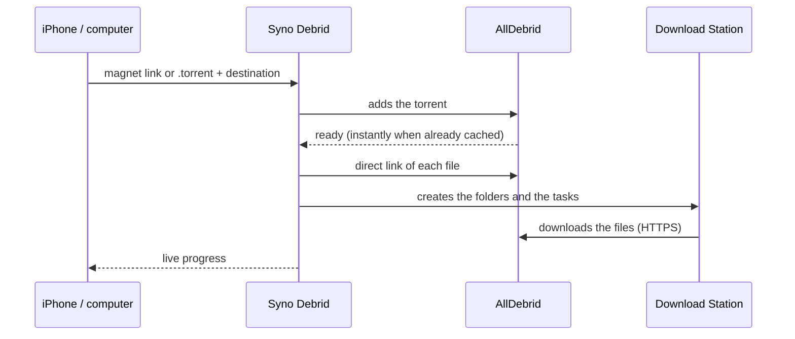

<p align="center">
  
</p>

<h1 align="center">Syno Debrid</h1>

<p align="center"><b>English</b> · <a href="README.fr.md">Français</a></p>

<p align="center">
  A magnet link or a <code>.torrent</code> file goes through AllDebrid, and the files land in
  <b>Download Station</b> on your Synology, in the right folder.
</p>

<p align="center">
  
  
  
</p>
<p align="center">
  
</p>

<details>
<summary>More screenshots</summary>

<p align="center">
  
  
  
</p>
<p align="center">
  
  
</p>

</details>

## Features

- **AllDebrid.** The debrid service fetches the torrent, then the NAS downloads the files over
  HTTPS. The NAS never does any P2P.
- **Magnet links** (one or several at once), hashes, or **`.torrent` files**: drag and drop on a
  computer, the Files app on an iPhone.
- **The right folder.** Destinations (Movies → `video/Movies`, TV Shows → `video/TV`…) are set up
  by browsing the NAS folders, creating a new one on the way if needed; you pick one each time you
  add a download. The last one used is remembered.
- **Like a BitTorrent client.** A torrent with several files gets its own folder, with its
  subfolders.
- **Live progress.** At the debrid service, then in Download Station, file by file, with retry and
  stop.
- **An account for the app, a DSM account for Download Station.** You sign in to the app with its
  own password, or with no password at all behind a proxy that authenticates (Authelia…).
  Downloads are created with a DSM account chosen in the settings, ideally a dedicated one. The app
  logs back in by itself: downloads carry on without anyone.
- **Made for the iPhone.** The app installs on the home screen, switches to dark mode on its own,
  and speaks English and French.
- **Light.** A Docker image of about 60 MB (amd64 and arm64), no database.

## How it works



## Installing on a Synology

Requirements: DSM 7.2 or later, with **Container Manager** and **Download Station** (installed from
the Package Center).

1. In **File Station**, create a `docker/syno-debrid` folder.
2. In **Container Manager**, open **Project → Create** and fill in:
   - name: `syno-debrid`;
   - path: the folder created in step 1;
   - source: "Create docker-compose.yml".

   Then paste the content of [`docker-compose.yml`](docker-compose.yml).

3. Confirm: the image is downloaded and the container starts.
4. Open **`http://NAS-IP:8080`** and create the app's account.
5. The home screen lists what is left to do, from the **Settings** (⚙︎):
   - connect Download Station: NAS address (`http://NAS-IP:5000`), DSM account and password;
   - paste the AllDebrid API key;
   - add the destinations.

Whoever opens the app first creates the account: do this step before opening access from outside.

`PUID` and `PGID` set who owns the files in `./data`. `1026:100` is the first user created on the
NAS and the `users` group; the `id` command, over SSH, tells you for sure. Outside Container
Manager, `docker compose up -d` is all it takes.

### A dedicated DSM account (recommended)

The app only needs Download Station and the download folders. A separate account limits what it
can do on the NAS:

1. **Control Panel** → **User & Group** → **Create**: for example `syno-debrid`, with a strong
   password.
2. **Shared folders**: read/write on the destination folders (`video`…), no access to the others.
3. **Applications**: allow only **Download Station** and **File Station**.

The downloaded files then belong to this account; the shared folders keep the NAS's permissions.

## Updating

In **Container Manager**:

1. **Project** → `syno-debrid` → **Action** → **Stop**, then **Clean**: the container is removed,
   not the settings.
2. **Image**: delete `ghcr.io/piitaya/syno-debrid`.
3. **Project** → `syno-debrid` → **Action** → **Build**: the latest image is downloaded and the app
   starts again.

Elsewhere: `docker compose pull && docker compose up -d`.

The account, settings, API keys, sessions and running downloads are in the project's `data`
folder, in JSON files only their owner can read: that is the folder to back up. It also holds the
DSM account's encrypted password and its key (`secret.key`): keep the backup private.

## Configuration

The account, the Download Station connection, the API keys and the destinations are set up in the
app. The rest goes through environment variables.

| Variable           | Default         | Purpose                                                                      |
| ------------------ | --------------- | ---------------------------------------------------------------------------- |
| `PUID` / `PGID`    | `1000` / `1000` | Owner of the files in `/data`.                                               |
| `PORT`             | `8080`          | HTTP port of the container.                                                  |
| `TRUST_PROXY`      | `false`         | Trust `X-Forwarded-For` (behind a reverse proxy).                            |
| `AUTH`             | `password`      | `none`: no sign-in to the app, a reverse proxy takes care of it (see below). |
| `SESSION_TTL_DAYS` | `30`            | Signed out after this many days without opening the app.                     |
| `LOG_LEVEL`        | `info`          | `debug`, `info`, `warn` or `error`.                                          |

## Accounts and security

- **The app's account.** It is created on the first start, with a password of at least 8
  characters, which can be changed in the Settings; the other devices are then signed out. You
  stay signed in as long as you open the app at least once every 30 days.
- **Forgotten password.** Delete `account.json` from the `data` folder, then restart the
  container: the app offers to create the account again. Settings, the Download Station
  connection and downloads are kept.
- **DSM account.** It needs **Download Station**, **File Station** (to browse and create folders)
  and write access to the destination folders. The app keeps its password, **encrypted**, to log
  back in when DSM ends the session (after 7 days, or when the NAS restarts).
- **DSM password changed.** The app tries the old one only once, then waits: new downloads show
  "Waiting for Download Station" until the new password is entered in Settings → Download Station.
  Those already handed over to Download Station carry on.
- **2-step verification.** If the DSM account uses it, the code is asked only once, when
  connecting Download Station.
- **DSM auto block.** By default, DSM blocks an IP address after 10 failed logins within 5
  minutes, and every login to DSM comes from the container. So the app limits its own failures
  with DSM (6 per 5 minutes) and never tries a refused password again. Sign-ins to the app don't go
  through DSM: 5 failures per 15 minutes and per IP address.

## On the iPhone

- **Home screen.** In Safari: Share → "Add to Home Screen".
- **Magnet link.** Copy it, tap **+**, then **Paste** (available over HTTPS) or long-press in the
  field.
- **`.torrent` file.** The **Choose a .torrent file** button opens the Files app.
- **From the share sheet** (optional). In the Shortcuts app, create a shortcut that:
  1. receives URLs or text from the share sheet;
  2. passes them to **URL Encode**;
  3. opens `https://your-address/?magnet=` followed by the result.

  The app then opens on the add sheet, with the link filled in.

- **On a computer** (over HTTPS), Settings → "Open magnet links with this app": clicking a magnet
  link then opens the app with it. Pasting a link or dropping a `.torrent` anywhere on the page
  works too.

## Access from outside

The simplest and safest way is a VPN: Tailscale, or the VPN Server package.

Otherwise, use DSM's reverse proxy with HTTPS: Control Panel → Login Portal → Advanced → Reverse
Proxy. Source `https://debrid.mydomain.com`, destination `http://localhost:8080`, then add
`TRUST_PROXY=true` to the container. Create the app's account before opening this access.

### Without a password (Authelia…)

With `AUTH=none`, the app no longer asks for an account: the reverse proxy decides who gets in,
for example with Authelia or Authentik. DSM's reverse proxy cannot authenticate (it only filters
IP addresses): you need another proxy, such as Nginx Proxy Manager, Traefik or Caddy.

The app must then be reachable **only through that proxy**: don't publish port `8080` on the
network (put it on the same Docker network as the proxy, or publish `127.0.0.1:8080:8080`).

## Good to know

- **AllDebrid** refuses server and VPN IP addresses: the app must run at home, and the NAS is the
  perfect place.
- **NAS address.**
  - From the container, `localhost` is not the NAS: use its IP address.
  - If DSM redirects HTTP to HTTPS, enter the HTTPS address directly (port 5001), turning on
    "Self-signed certificate" if needed.

## Development

```bash
npm install
npm run demo          # all in one: http://localhost:5173, with a fake NAS and sample downloads
```

`npm run demo` starts the web app and the API, both reloaded on every change, and fake versions of
the NAS and AllDebrid, with sample settings and downloads. Sign in with `demo` / `demo1234`. With
`DEMO_SEED=0`, the app starts as on a first start; accounts of the fake NAS, to connect Download
Station:

- `syno-debrid` / `syno-debrid` or `paul` / `paul`;
- `secure` / `secure`: 2-step verification, code `123456`.

To work with a real NAS, copy `.env.example` to `.env`, then run `npm run dev` (API on :8080, web
app on http://localhost:5173): the NAS address is entered in the app.

```bash
npm test              # tests (Vitest)
npm run lint && npm run typecheck
npm run build && npm start
npm run build && npm run screenshots   # README screenshots (Playwright's Chromium, or CHROMIUM_PATH)
```

Stack: Node.js 24, TypeScript, [Hono](https://hono.dev) on the server, [Lit](https://lit.dev) and
[Vite](https://vite.dev) for the web app.

| Folder               | Content                                                           |
| -------------------- | ----------------------------------------------------------------- |
| `src/server/`        | API, account, NAS connection, download tracking (`jobs.ts`)       |
| `src/server/nas/`    | DSM client: login, Download Station, File Station                 |
| `src/server/debrid/` | AllDebrid                                                         |
| `src/web/`           | Web app (Lit components)                                          |
| `src/shared/`        | API types, reading magnet links and `.torrent` files              |
| `test/`              | Tests, and fake versions of the NAS and AllDebrid (`test/mocks/`) |

The Docker images (amd64 and arm64) are built by GitHub Actions and published to
`ghcr.io/piitaya/syno-debrid` on every push to `main` and every `v*` tag.

## Project status

The app has been tried on a real Synology NAS with AllDebrid. It is also tested end to end against
fake versions of the DSM, Download Station, File Station and AllDebrid APIs, written from their
official documentation.

Syno Debrid is neither affiliated with nor endorsed by Synology. Synology, DSM and Download Station
are trademarks of Synology Inc.
