<p align="center">
  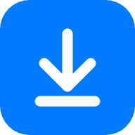
</p>

<h1 align="center">Syno Debrid</h1>

<p align="center"><b>English</b> · <a href="README.fr.md">Français</a></p>

<p align="center">
  Download torrents to your Synology through AllDebrid.<br>
  Add a magnet link or a <code>.torrent</code> file, pick a folder, and <b>Download Station</b>
  does the rest.
</p>

<p align="center">
  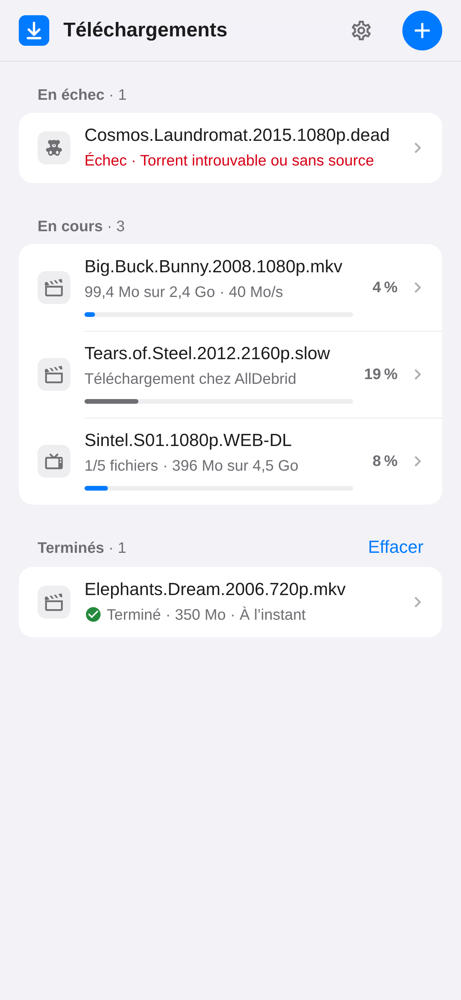
  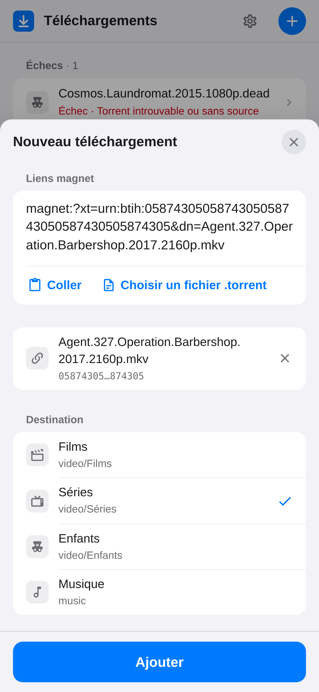
  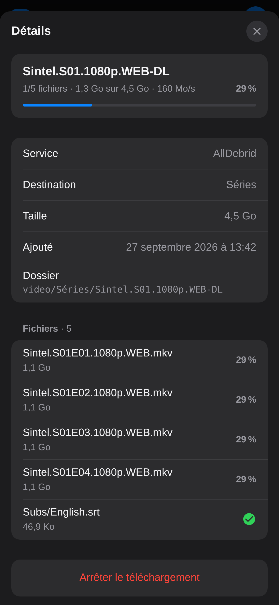
</p>
<p align="center">
  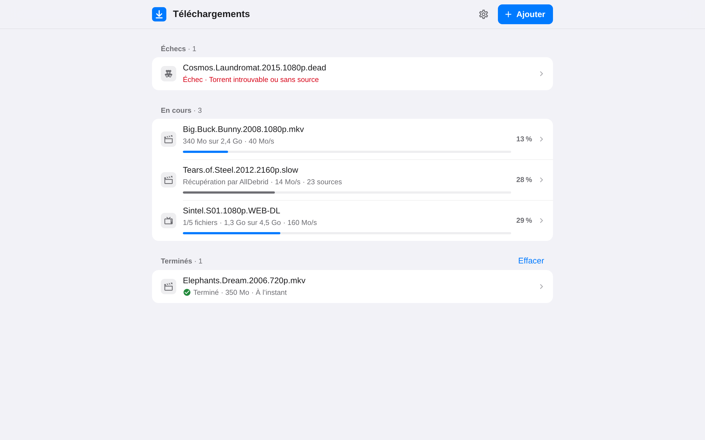
</p>

<details>
<summary>More screenshots</summary>

<p align="center">
  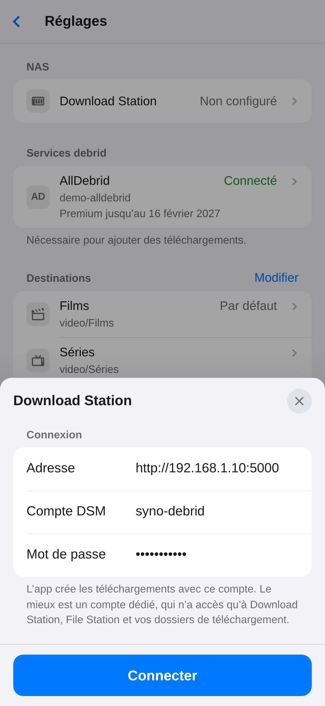
  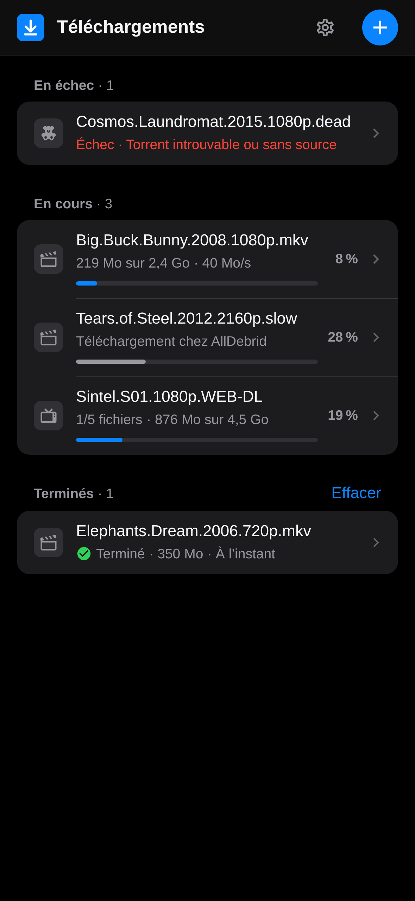
  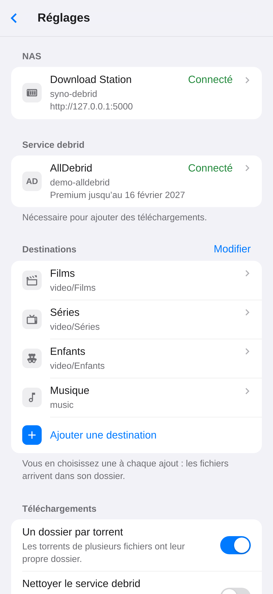
</p>
<p align="center">
  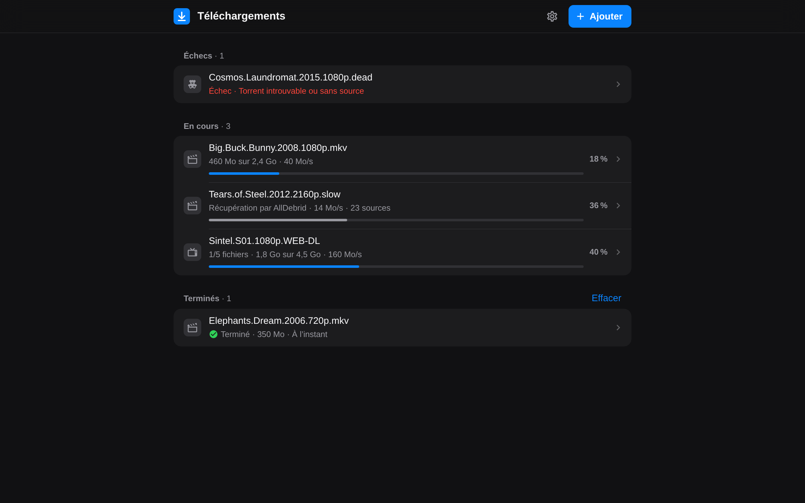
  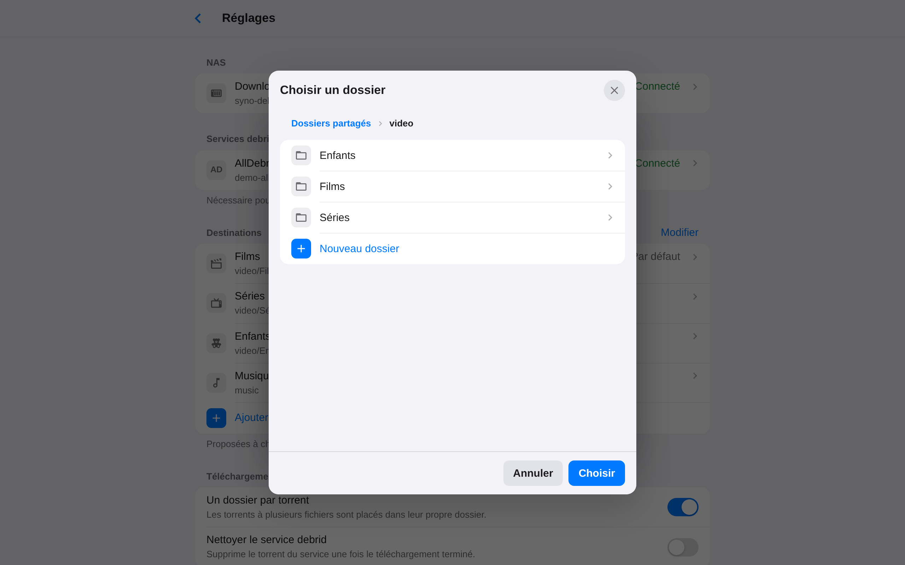
</p>

</details>

## Features

- **No P2P on your NAS.** AllDebrid downloads the torrent, then your NAS fetches the files from
  AllDebrid over HTTPS.
- **Magnet links and `.torrent` files.** Paste one or more magnet links (or plain hashes), or add
  a `.torrent` file: drag and drop it on a computer, or pick it from your files on a phone.
- **Straight to the right folder.** Set up destinations such as Movies → `video/Movies` or TV
  Shows → `video/TV` by browsing your NAS, creating folders along the way if needed. Then pick one
  each time you add a download; the app remembers your last choice.
- **Tidy, like a BitTorrent client.** A torrent with several files gets its own folder,
  subfolders included.
- **Live progress.** Follow each download at AllDebrid, then in Download Station, file by file.
  Retry a download that failed, or stop one in progress.
- **Two separate accounts.** You sign in to the app with its own password, or not at all behind a
  proxy that handles sign-in (Authelia…). The app creates the downloads with a DSM account of your
  choice, ideally a dedicated one, and logs back in by itself, so downloads keep going without
  you.
- **Made for your phone.** A web app you add to your home screen, on iPhone or Android. It follows
  dark mode and speaks English and French.
- **Lightweight.** A Docker image of about 60 MB (amd64 and arm64), no database.

## How it works

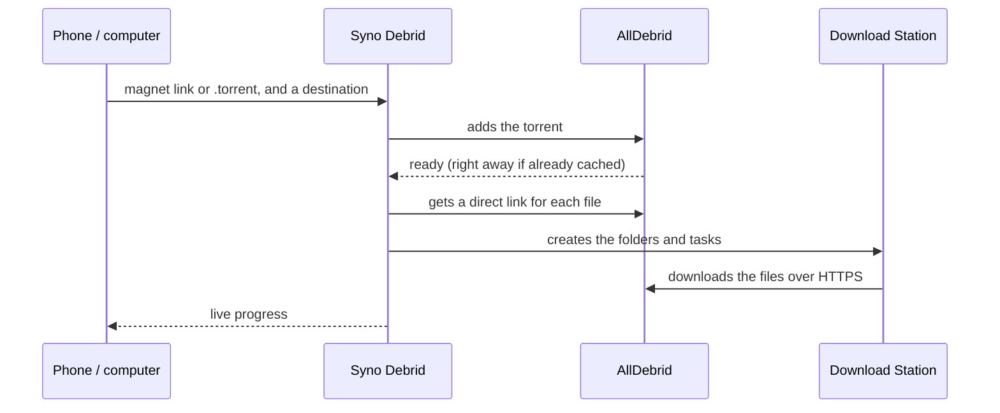

## Install on a Synology

You need DSM 7.2 or later, with **Container Manager** and **Download Station** installed from the
Package Center.

1. In **File Station**, create a `docker/syno-debrid` folder.
2. In **Container Manager**, go to **Project → Create** and fill in:
   - Project name: `syno-debrid`
   - Path: the folder you just created
   - Source: "Create docker-compose.yml"

   Then paste the contents of [`docker-compose.yml`](docker-compose.yml).

3. Confirm. Container Manager downloads the image and starts the container.
4. Open **`http://NAS-IP:8080`** and create your account.
5. The home screen lists what's left to set up, all in **Settings** (⚙︎):
   - connect Download Station with the NAS address (`http://NAS-IP:5000`) and a DSM account;
   - paste your AllDebrid API key;
   - add your destinations.

The first person to open the app creates the account, so do it before you make the app reachable
from the internet.

`PUID` and `PGID` set who owns the files in `./data`. `1026:100` is usually the first user created
on the NAS, in the `users` group; run `id` over SSH to check. Not using Container Manager?
`docker compose up -d` is all you need.

### A dedicated DSM account (recommended)

The app only needs Download Station and your download folders. Giving it its own account limits
what it can do on your NAS:

1. In **Control Panel** → **User & Group**, create a user, for example `syno-debrid`, with a
   strong password.
2. Give it read/write access to your destination folders (`video`…), and no access to the other
   shared folders.
3. In its application permissions, allow only **Download Station** and **File Station**.

Downloaded files then belong to this account. Access to them still follows your shared folder
permissions.

## Update

In **Container Manager**:

1. In **Project**, select `syno-debrid`, then **Action** → **Stop**, and **Action** → **Clean**.
   This removes the container, not your data.
2. In **Image**, delete `ghcr.io/piitaya/syno-debrid`.
3. Back in **Project**, select `syno-debrid`, then **Action** → **Build**. Container Manager
   downloads the latest image and starts the app again.

With Docker Compose: `docker compose pull && docker compose up -d`.

### Backup

Everything the app keeps lives in the project's `data` folder: your account, settings, AllDebrid
API key, sessions and downloads in progress, as JSON files only their owner can read. That's the
folder to back up. It also holds the encrypted DSM password and its key (`secret.key`), so keep
your backup private.

## Configuration

Your account, the Download Station connection, the AllDebrid API key and the destinations are all
set up in the app. Everything else is an environment variable:

| Variable           | Default         | Description                                                            |
| ------------------ | --------------- | ---------------------------------------------------------------------- |
| `PUID` / `PGID`    | `1000` / `1000` | Owner of the files in `/data`.                                         |
| `PORT`             | `8080`          | Port the app listens on.                                               |
| `TRUST_PROXY`      | `false`         | Trust `X-Forwarded-For`. Turn it on behind a reverse proxy.            |
| `AUTH`             | `password`      | `none` turns off sign-in, when a reverse proxy handles it (see below). |
| `SESSION_TTL_DAYS` | `30`            | Days without opening the app before you are signed out.                |
| `LOG_LEVEL`        | `info`          | `debug`, `info`, `warn` or `error`.                                    |

## Accounts and security

- **Your account.** You create it the first time you open the app, with a password of at least 8
  characters. Changing the password in Settings signs out your other devices. You stay signed in
  as long as you open the app at least once every 30 days.
- **Forgot your password?** Delete `account.json` from the `data` folder and restart the
  container. The app asks you to create a new account, and keeps your settings, the Download
  Station connection and your downloads.
- **The DSM account** needs **Download Station**, **File Station** (to browse and create folders)
  and write access to your destination folders. The app stores its password, **encrypted**, so it
  can log back in when DSM ends the session (after 7 days, or when the NAS restarts).
- **Changed the DSM password?** The app tries the old one only once. New downloads then show
  "Waiting for Download Station" until you enter the new password in Settings → Download Station.
  Downloads already handed over to Download Station keep going.
- **2-step verification.** If the DSM account uses it, you only enter a code once, when you
  connect Download Station.
- **DSM auto block.** By default, DSM blocks an IP address after 10 failed logins within 5
  minutes, and all of the app's DSM logins come from the container. So the app allows itself at
  most 6 failed DSM logins every 5 minutes, and never retries a refused password. Signing in to
  the app doesn't involve DSM; it is limited to 5 failed attempts per IP address every 15 minutes.

## On a phone

- **Home screen.** On iPhone, in Safari, tap Share → "Add to Home Screen". On Android, in Chrome,
  open the ⋮ menu → "Add to Home screen".
- **Magnet link.** Copy it, tap **+**, then **Paste** (HTTPS only), or long-press in the text
  field.
- **`.torrent` file.** The **Choose a .torrent file** button opens your files.
- **From the iPhone share sheet** (optional). In the Shortcuts app, create a shortcut that:
  1. receives URLs and text from the share sheet;
  2. runs them through **URL Encode**;
  3. opens `https://your-address/?magnet=` followed by the result.

  Share a magnet link to this shortcut, and the app opens with the link already filled in.

## On a computer

Paste a link or drop a `.torrent` file anywhere on the page. Over HTTPS, turn on Settings → "Open
magnet links with this app", and magnet links you click open straight in the app.

## Access from outside your home

The simplest and safest option is a VPN, such as Tailscale or Synology's VPN Server package.

Otherwise, use DSM's reverse proxy with HTTPS, in Control Panel → Login Portal → Advanced →
Reverse Proxy: set the source to `https://debrid.example.com` and the destination to
`http://localhost:8080`, then add `TRUST_PROXY=true` to the container. Create your account before
you open access.

### Without sign-in (Authelia…)

With `AUTH=none`, the app no longer asks anyone to sign in: your reverse proxy decides who gets
in, for example with Authelia or Authentik. DSM's reverse proxy can't do that (it only filters IP
addresses), so you need another one, such as Nginx Proxy Manager, Traefik or Caddy.

The app must then be reachable **only through that proxy**. Don't expose port `8080` to your
network: put the app on the same Docker network as the proxy, or publish `127.0.0.1:8080:8080`.

## Good to know

- **AllDebrid blocks server and VPN IP addresses**, so the app has to run at home. Your NAS is the
  perfect place for it.
- **The NAS address.** Inside the container, `localhost` isn't the NAS: use its IP address. If DSM
  redirects HTTP to HTTPS, enter the HTTPS address (port 5001) directly, and turn on "Self-signed
  certificate" if needed.

## Development

```bash
npm install
npm run demo          # http://localhost:5173, with a fake NAS and sample downloads
```

`npm run demo` starts the web app and the API with live reload, along with fake versions of the
NAS and AllDebrid, sample settings and a few downloads. Sign in with `demo` / `demo1234`. To go
through the first start instead, set `DEMO_SEED=0`, then connect Download Station with one of the
fake NAS accounts:

- `syno-debrid` / `syno-debrid`, or `paul` / `paul`;
- `secure` / `secure`, with 2-step verification (code `123456`).

To work with a real NAS, copy `.env.example` to `.env` and run `npm run dev` (API on :8080, web app
on http://localhost:5173), then enter the NAS address in the app.

```bash
npm test              # tests (Vitest)
npm run lint && npm run typecheck
npm run build && npm start
npm run build && npm run screenshots   # README screenshots (Playwright's Chromium, or CHROMIUM_PATH)
```

Under the hood: Node.js 24 and TypeScript, [Hono](https://hono.dev) for the server,
[Lit](https://lit.dev) and [Vite](https://vite.dev) for the web app.

| Folder               | Contents                                                          |
| -------------------- | ----------------------------------------------------------------- |
| `src/server/`        | API, account, NAS connection, download tracking (`jobs.ts`)       |
| `src/server/nas/`    | DSM client: login, Download Station, File Station                 |
| `src/server/debrid/` | AllDebrid                                                         |
| `src/web/`           | Web app (Lit components)                                          |
| `src/shared/`        | API types, magnet link and `.torrent` parsing                     |
| `test/`              | Tests, and fake versions of the NAS and AllDebrid (`test/mocks/`) |

GitHub Actions builds the Docker images (amd64 and arm64) and publishes them to
`ghcr.io/piitaya/syno-debrid` on every push to `main` and every `v*` tag.

## Project status

Syno Debrid has been tried on a real Synology NAS with AllDebrid. Its tests also cover the whole
flow end to end, against fake versions of the DSM, Download Station, File Station and AllDebrid
APIs built from their official documentation.

Syno Debrid is an independent project, not affiliated with Synology. Synology, DSM and Download
Station are trademarks of Synology Inc.
